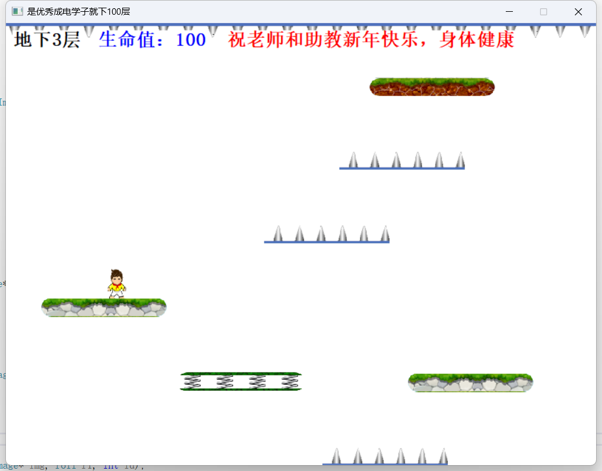

# Down100

​	本项目《是成电优秀学子就下100层》是类似《是男人就下100层》的一款C++游戏。

​	适用场景：本人C语言课自己找的素材，然后自己独立写出来的代码，后来C++课程上刚好使用面向对象的思想重新封装了一下，在封装过程中甚至还找到了当时没找到的bug（可见面对对象和封装思想的重要性！）。

此项目适用于作为本科阶段**课程设计**、**程序设计**、**C/C++编程**、**小游戏开发**等用途，供大家学习交流使用，若有用麻烦**点一个star**！

本人环境：Visual Studio 2019

## 游戏玩法

1. 在窗口界面中，开始生成小人（具有图片、宽和高，以及生成坐标位置和初始生命值）和具有不同特性的木板（具有图片、宽和高，以及生成坐标位置）以及上方一排尖刺（经测试，最后决定此尖刺不会减少生命值）.       

2. 小人可以通过玩家控制**键盘左右**移动。

3. 木板会间歇性地随机生成不同特性的木板且不断向上移动。

4. 木板具有四种类型。

   **硬木板**：人物与其碰撞可以停留在木板上，并随其一起向上移动。

   **软木板**：人物与其碰撞会向下移动一段距离，然后人物继续之前的运动。

   **弹簧**：人物与其碰撞会向上移动。

   **尖刺**：体现难度的道具，人物与其碰撞仍然可以停留在上面并随其移动，但停留在上面时会不断减少生命值。

5. 结束条件：

   当**玩家生命值为0**或者玩家掉到**窗口最下端**，则判定为**输**，游戏结束，并生成显示玩家已经输的界面。

   当**层数为100**时，则判定为**赢**，游戏结束，并生成显示玩家已经赢的界面。

6. 游戏具有背景音乐和输赢的音效，以及记录生命值和层数的记分板。

## 实验原理

- 利用 acllib 库提供的函数，通过 C++语音生成图形界面，实现游戏的开发。 
- 利用事件回调函数，键盘事件控制人物左右移动，时间事件使人物自动下坠，各类模板自 动上升。
- 封装：C++增加了面对对象的概念，允许用户定义新的抽象数据类型—类类型，其将一组 数据和与这些数据相关的操作封装再一起，实现了面向对象技术中的核心概念—数据封装。
- 继承：基于已有的类，可以建立新的类，这个新的类既可以重用已有类的功能，又可以扩 展了新的功能，继承定义了类如何相互关联，共享特性。继承就是在一个存在的类的基础上 建立另一个新的类。 
- 多态：同一个函数的行为随调用的上下文而有所不同。

## 文件说明

项目正确打开如图所示：

封装+继承：分别对base类，person类，object类，以及硬木板，弹簧，尖刺，软木板进行了封装，继承关系（都为公有派生）和各类的定义如下图所示

